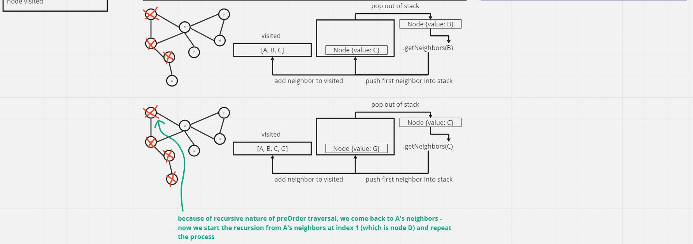

# Code Challenge: Class 35(graph) + 36 (breadthFirst)

[graph.js](./graph.js)

Implement a directed graph data structure. The graph should be represented as an adjacency list and should include the following methods:

- add vertex
  - Arguments: value
  - Returns: The added vertex
  - Add a vertex to the graph

- add edge
  - Arguments: 2 vertices to be connected by the edge, weight (optional)
  - Returns: nothing
  - Adds a new edge between two vertices in the graph
  - If specified, assign a weight to the edge
  - Both vertices should already be in the Graph

- get vertices
  - Arguments: none
  - Returns all of the vertices in the graph as a collection (set, list, or similar)
  - Empty collection returned if there are no vertices

- get neighbors
  - Arguments: vertex
  - Returns a collection of edges connected to the given vertex
    - Include the weight of the connection in the returned collection
  - Empty collection returned if there are no vertices

- size
  - Arguments: none
  - Returns the total number of vertices in the graph
  - 0 if there are none

- breadthFirst
  - Arguments: none
  - Returns all nodes visited

## Whiteboard Process

### addEdge


### addVertex


### breadthFirst


### depthFirst



*I only made a UML for the `addVertex`, `addEdge`, and `breadthFirst` methods since the other three methods are just one liners that use the built-in methods & properties from the [Map](https://developer.mozilla.org/en-US/docs/Web/JavaScript/Reference/Global_Objects/Map) data structure.*

-`getVertices` uses [Map.keys()](https://developer.mozilla.org/en-US/docs/Web/JavaScript/Reference/Global_Objects/Map/keys)
-`getEdges` uses [Map.get()](https://developer.mozilla.org/en-US/docs/Web/JavaScript/Reference/Global_Objects/Map/get)
-`size` uses [Map.size](https://developer.mozilla.org/en-US/docs/Web/JavaScript/Reference/Global_Objects/Map/size)


## Approach and Efficiency

### addEdge()
- **Approach:**
  The first thing we have to establish is if the `startVertex` &/o `endVertex` arguments exist within the adjacency list - if either one DO NOT exist then we need to throw an error because we cannot establish an edge between nodes that do not exist.

  After that, we simply create an edge using the `endVertex` and the `weight` arguments. Then get the exisiting edges from the `startVertex` by using the `.get()` method of the `Map` data structure, and push the new edge into the array of existing edges.

- **Efficiency:** 

  - Time: O(1) because `.get()` reads directly from our `Map` and does not require looping/iterating. 

  - Space: O(1) because we're always instantiating a single `Edge` object and adding it to the array of existing edges.

### addVertex()
- **Approach:**
  First we need to instantiate a new `Vertex` object and pass the `value` argument of `.addVertex()` into the `Vertex` constructor. Once we have our vertex object, we can call `.set()` on our adjacencyList and pass in the vertex and an empty array. The empty array will hold all of the vertex's edges/neighbors if they are ever estabished.

- **Efficiency:** 

  - Time: O(1), because the method `.set()` from the `Map` data structure will always add to the end of the map, therefore there is no looping/iterating and it knows exactly where the new data needs to be put.

  - Space: O(1), because we're always returning a single `Vertex` object

### breadthFirst()
- **Approach:**
  Since the method does not take an argument, we start at the very first vertex in our adjacency list. We know how breadth first traversal operates because they are similar to a tree, except we know that they can potentially have cycles which would result in an endless loop. To prevent this, whenever we traverse across a vertex we push it into a `visited` array and at the beginning of every loop/traversal we check to see if the vertex we are currently visiting already exists in the `visited` array.

  From there we enqueue each vertex into a queue and continue to loop through the graph so long as the queue is not empty. Every loop, we dequeue the front of the queue, and then check if that dequeued vertex has any neighbors. If it does, we check to see if those neighbors already exist within `visited` and if they DO NOT then we enqueue them and add them to the `visited` array.


- **Efficiency:** 

- Time: O(n), because the time taken to complete the traversal depends on how many vertices a graph has or how many vertices are linked together.

- Space: O(1), because we're returning an array of all vertices visited.

### depthFirst()
- **Approach:**
  Similar to the breadthFirst method, we need to keep track of the nodes that we visit. So on the initial method invocation, we set that as the first value of the `visited` array as well as push that vertex into a `stack`.

  From there, we run a while loop that iterates so long as the stack is not empty. Then we pop off the top node in the `stack` and check if it has any neighbors. 

  If it does have neighbors, then we iterate through them and check if they already exist within the `visited` array. If they DO NOT exist within `visited` then we set `visited = [...visited, ...depthFirst(neighbor)]` and push the neighbor into the `stack`. From there, the while loop continues until its condition is no longer satisfied.


- **Efficiency:** 

- Time: O(n) because it depends on how many nodes are linked together in the graph

- Space: O(n) because the array that we return represents each node visited

## Solution

```
class Vertex {
  constructor(value){
    this.value = value;
  }
}

class Edge {
  constructor(vertex, weight){
    this.vertex = vertex;
    this.weight = weight;
  }
}

class Graph {
  constructor() {
    this.adjacencyList = new Map();
  }

  addVertex = (value) => {
    let newVertex = new Vertex(value);
    // the array used as the second argument will hold all the adjacent vertices to the first argument
    this.adjacencyList.set(newVertex, [])
    return newVertex;
  }

  addEdge = (startVertex, endVertex, weight = 0) => {
    // check to see if adjacencyList has start and end vertices
    if (!this.adjacencyList.has(startVertex)){
      console.error('startVertex argument is not in adjacencyList')
    } else if (!this.adjacencyList.has(endVertex)){
      console.error('endVertex argument is not in adjacencyList')
    }
    // instantiate new edge
    const newEdge = new Edge(endVertex, weight);
    // get the startVertex
    const startVertexEdges = this.adjacencyList.get(startVertex);
    // push the edge into the array of adjacent vertices
    startVertexEdges.push(newEdge)
  }

  getVertices = () => {
    // return all the vertices of a graph
    return [...this.adjacencyList.keys()]
  }

  getNeighbors = (vertex) => {
    // return the edges of a given node
    return this.adjacencyList.get(vertex);
  }

  size = () => {
    return this.adjacencyList.size;
  }

  breadthFirst = () => {
    let vertices = this.getVertices();
    if(!vertices.length){
      console.error('Graph has no vertices. Cannot execute breadth first traversal')
    };
    let queue = new Queue(vertices[0]);
    let visited = [vertices[0]];

    while(!queue.isEmpty()){
      let dqVertex = queue.dequeue().value;
      let dqNeighbors = this.getNeighbors(dqVertex);
      if (dqNeighbors.length > 0) {
        dqNeighbors.forEach(neighbor => {
          if (!visited.find(item => item === neighbor.vertex)) {
            visited.push(neighbor.vertex);
            queue.enqueue(neighbor.vertex);
          }
        })
      }
    }

    return visited;
  }

  depthFirst = (vertex) => {
    let stack = new Stack();
    let visited = [vertex.value];
  
    stack.push(vertex);

    while(!stack.isEmpty()){
      let popped = stack.pop();
      let neighbors = this.getNeighbors(popped.value);
  
      if (neighbors.length){
        neighbors.forEach(neighbor => {
          if(!visited.includes(neighbor.vertex.value)){
            visited = [...visited, ...this.depthFirst(neighbor.vertex)];
            stack.push(neighbor.vertex);
          }
        })
      }
    }
  
    return visited;
  }  
}
```