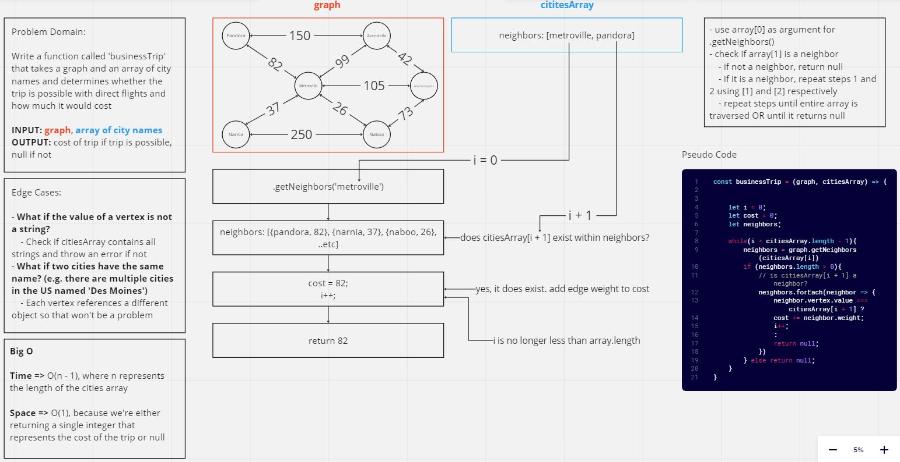

# Code Challenge: Class 37

[businessTrip.js](./businessTrip.js)

Write a function called 'businessTrip' that takes a graph and an array of city names and determines whether the trip is possible with direct flights and how much it would cost.

INPUT: a graph, an array of city names
OUTPUT: cost of trip if possible, or null

## Whiteboard Process



## Approach and Efficiency

- **Approach:**
  I knew that we were going to need to compare a current element in the array with the very next element in the array, so we start by intializing a variable `i` at 0. We'll also have to return the cost which will be updated on every successful 'trip' to a new city, so we also initialize a variable `cost` at 0. From there we also need to initialize two more variables, `neighbors` and `start` which represnet the neighbors of a given vertex and the city that we're departing from - these will both be updated on every iteration of a loop.

  Then we run a while loop that iterates so long as `i` is less than the length of the cities array - 1, because once we're at our final destination we don't need to check for any more flight costs.

  Within the loop, we find our starting city (`start`) and then get the neighbors/edges of that starting city (`neighbors`). 
  
  If `neighbors` comes back empty, then we return `null` because that means there is no connecting flight between our current city and the next desired location. 
  
  Then we check if `neighbors` contains the city at `[i + 1]`, because that represents our next desired location. If `neighbors` DOES contain the city at `[i + 1]`, then we add the cost of that flight to `cost` and increment `i` by 1 and then restart our loop.

  If `neighbors` DOES NOT contain the city at `[i + 1]` then we return `null` because that means that we CANNOT take a flight from our current city to the next desired city.

  If we make it through the while loop and all destinations are able to connect to one another, then we return the `cost` of the trip.


- **Efficiency:** 

- Time: O(n - 1), where n represents the length of the cities array and `-1` because we don't want to iterate on the very last element of the cities array

- Space: O(1), because we're either returning a single integer that represents the cost of the trip or null.

## Solution

```
const businessTrip = (graph, citiesArray) => {
  let i = 0;
  let cost = 0;
  let neighbors;
  let start;

  let vertices = graph.getVertices();
  
  // citiesArray.length - 1 because we don't want to run the loop on the last element of citiesArray since that would be our last stop in the business trip
  while(i < citiesArray.length - 1){
      
      start = vertices.find(vertex => vertex.value === citiesArray[i])
      neighbors = graph.getNeighbors(start)

      if (neighbors.length > 0){
        // is citiesArray[i + 1] a neighbor?
        let foundNeighbor = neighbors.find(neighbor => neighbor.vertex.value === citiesArray[i + 1]);
        if (foundNeighbor){
          cost += foundNeighbor.weight;
          i++;
        } else {
          // return null if neighbor does not exist
          return null;
        }
      } else {
        // return null if there are no neighbors at all
        return null;
      }
  }

  return cost;
}
```