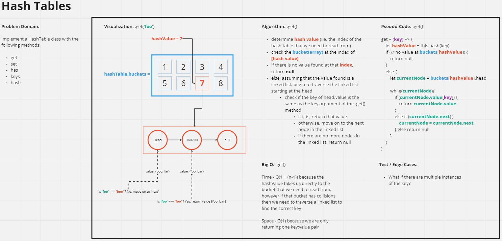
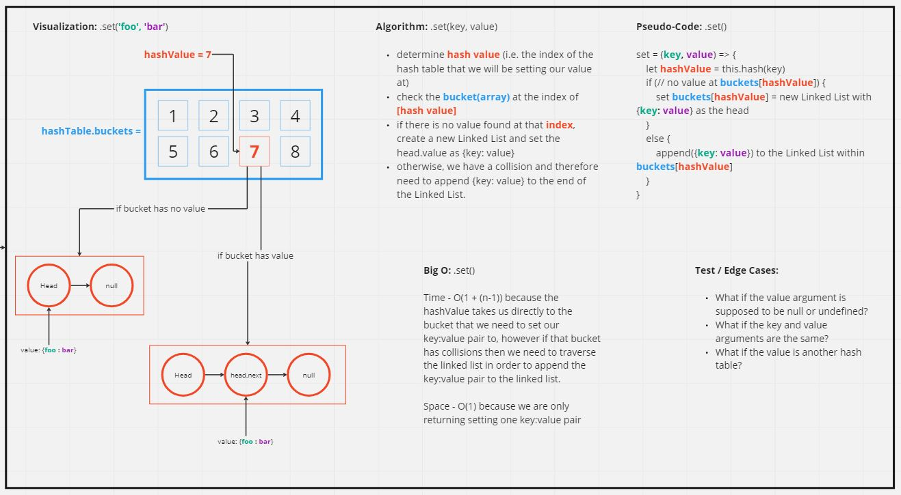
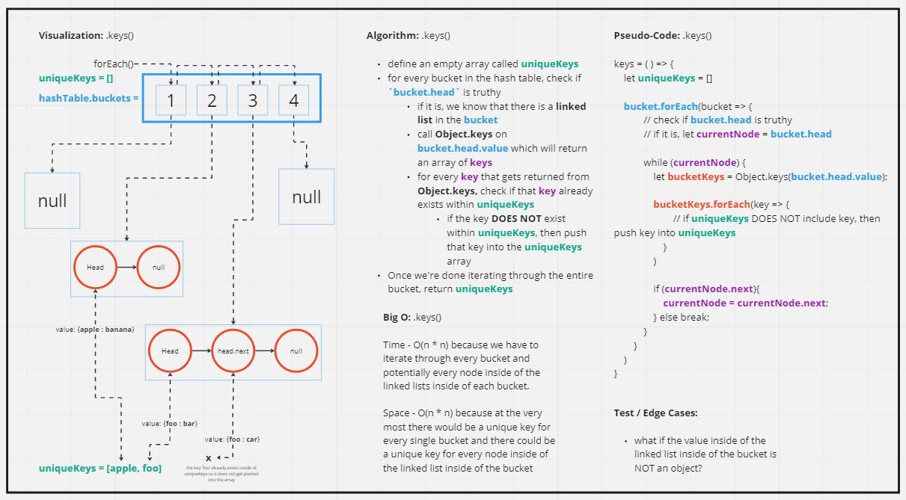

# Code Challenge: Class 27

Implement a Hashtable Class with the following methods:

- `set`
  - Arguments: key, value
  - Returns: nothing
  - This method should hash the key, and set the key and value pair in the table, handling collisions as needed.
  - Should a given key already exist, replace its value from the value argument given to this method.

- `get`
  - Arguments: key
  - Returns: Value associated with that key in the table

- `has`
  - Arguments: key
  - Returns: Boolean, indicating if the key exists in the table already.

- `keys`
  - Returns: Collection of keys

- `hash`
  - Arguments: key
  - Returns: Index in the collection for that key

## Whiteboard Process

### .get() & .has()



- `.get()` and `.has()` effectively follow the same logic but the main difference is that:
  - `.get()` returns either a `key:pair` value OR `null`
  - `.has()` returns either `true` OR `false` 

### .set()


### .keys()



## Approach and Efficiency

### .get(key)
- **Approach**
  - Since we know that the value of any bucket will a linked list in order to account for potential collisions, we know that we can traverse the linked list to find a specific key if we need to.
  - Once we identify the specific bucket we need to read from, we can then check if the `head.value[key]` of the linked list within the bucket matches the `key` argument given to the `.get()` method. 
    - If it does, we return `head.value`. If not, we continue to traverse the linked list and check if `node.value[key]` matches `key`. 
    - If we make it to the end of the linked list without finding a match, we return null.

- **Efficiency**: 
  - Time of O(1 + (n-1)) because the hashValue takes us directly to the bucket that we need to read from, however if that bucket has collisions then we need to traverse a linked list to find the correct key
  - Space of O(1) because we are only returning one `key:value` pair

## Solution

```
class HashTable {
  constructor(size){
    this.size = size;
    this.buckets = new Array(size);
  }

  set = (key, value) => {
    let hashValue = this.hash(key);

    if (!this.buckets[hashValue]) {
      this.buckets[hashValue] = new LinkedList({[key]: value})
    }
    else {
      this.buckets[hashValue].append({[key]: value})
    }
  }

  get = (key) => {
    let hashValue = this.hash(key);

    if (!this.buckets[hashValue]){
      return null
    }
    // imitate the LinkedList method .includes(), but instead of returning a boolean we return the value from the bucket
    else {
      let currentNode = this.buckets[hashValue].head;
      while(currentNode) {
        if (currentNode.value[key]) {
          return currentNode.value;
        }
        else if (currentNode.next) {
          currentNode = currentNode.next
        } else return null
      }
    }
  }

  has = (key) => {
    let hashValue = this.hash(key);

    // if there is nothing stored at bucket[hashValue] then we immediately know that the key does not exist within the hash table
    if (!this.buckets[hashValue]) {
      return false;
    } 
    // imiate the LinkedList method .includes() but we are only searching for if the key exists in the node's value 
    else {
      let currentNode = this.buckets[hashValue].head;
      while(currentNode) {
        if (currentNode.value[key]) {
          return true;
        }
        else if (currentNode.next) {
          currentNode = currentNode.next
        } else return false
      }
    }
  }

  keys = () => {
    let uniqueKeys = [];

    this.buckets.forEach(bucket => {
      //if bucket.head is truthy, then we know that it has a LinkedList as it's value
      if(bucket.head){
        // begin to traverse the linked list
        let currentNode = bucket.head
        
        while(currentNode){
          // assuming the value of our bucket.head is an object, it can potentially have more than one key:value pair
          let bucketValueKeys = Object.keys(bucket.head.value);

          // for every key, we check if that key already exists within the 'uniqueKeys' array
          bucketValueKeys.forEach(key => {
            // add the key to the 'uniqueKeys' array if it DOES NOT already exist within the array
            if(!uniqueKeys.includes(key)){
              uniqueKeys.push(key)
            }
          })
          
          // once we're done iterating through one node of a linkedlist, we check if there is another node following
          if (currentNode.next) {
            currentNode = currentNode.next;
          } else break;
        }

      }
    })

    return uniqueKeys;
  }

  hash = (key) => {

    let spreadKey = [...key];
    let hashedKeys = [];

    spreadKey.forEach((k, idx) => {
      hashedKeys.push(key.charCodeAt(idx))
    })

    return hashedKeys.reduce((previousValue, currentValue) => previousValue * currentValue, 1) * 599 % this.buckets.length;

  }

}
```