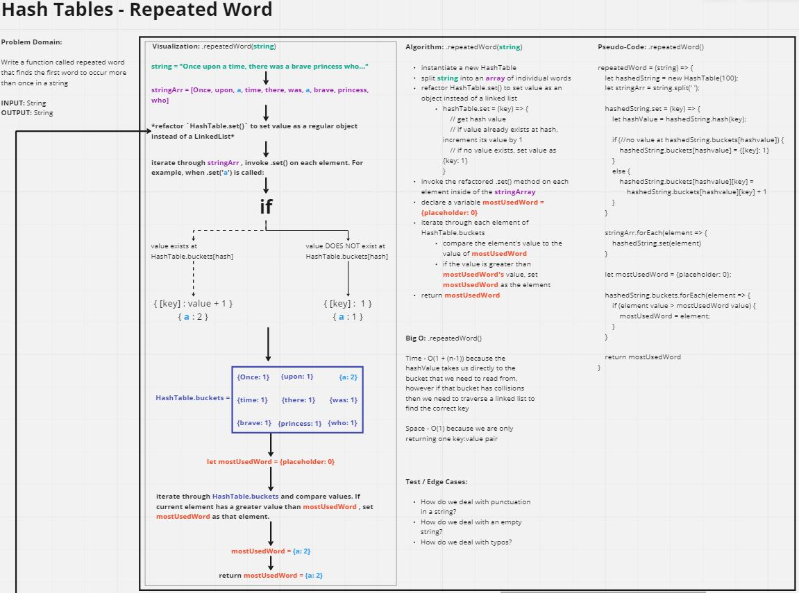

# Code Challenge: Class 27

[repeatedWord.js](./repeatedWord.js)

Write a function called repeated word that finds the first word to occur more than once in a string
Arguments: string
Return: string

## Whiteboard Process



## Approach and Efficiency

- **Approach:**
  - I knew that I could get about 90% of the way there using the standard `.set()` method on a Hash Table, however I also knew that having to deal with a Linked List would potentially cause more headache that necessary. 
  - I decided to refactor the HashTable's `.set()` method within the `.repeatedWord()` function so we can still maintain the original LinkedList functionality in the original HashTable data structure, but utilize a modified version of it strictly for the purpose of this function.
  - Instead of setting a bucket's value as a LinkedList, I decided to set it as a regular object and set the value of that object as an integer. That way, I could easily access the object and increment it's value to keep track of any individual word's count - instead of having to traverse a linked list.

- **Efficiency:** 

  - Time of O(n) where `n` represents the length of the `.buckets` array on the HashTable - because once we set all our values within the buckets we need to check each bucket to see if it has a value and then compare that value to the `mostUsedWord` variable.

  - Space of O(n + 1) where `n` represents the amount of unique words within the argument string because not only are we returning the `mostUsedWord`, I went for the stretch goal of returning an array of all unique words and their corresponding count, so therefore we will be returning an object with 2 properties: `mostUsedWord` and `allWordCount`

## Solution

```
const repeatedWord = (string) => {
  let hashedString = new HashTable(100);
  let cleanString = string.replace(/[^a-zA-Z ]+/g, '')
  let stringArr = cleanString.split(' ');

  hashedString.set = (key) => {
    let hashValue = hashedString.hash(key);

    if (!hashedString.buckets[hashValue]) {
      hashedString.buckets[hashValue] = {[key]: 1}
    }
    else {
      hashedString.buckets[hashValue][key] = hashedString.buckets[hashValue][key] + 1
    }
  }

  stringArr.forEach(element => {
    hashedString.set(element);
  })

  let mostUsedWord = {placeholder: 0};
  let allWordCount = [];

  hashedString.buckets.forEach(element => {
    if (element){
      allWordCount.push(element);
    }
    let elementValue = Object.values(element)[0];
    let mostUsedWordValue = Object.values(mostUsedWord)[0];
    if (elementValue > mostUsedWordValue) {
      mostUsedWord = element;
    };
  })

  return {
    mostUsedWord,
    allWordCount,
  };
}
```