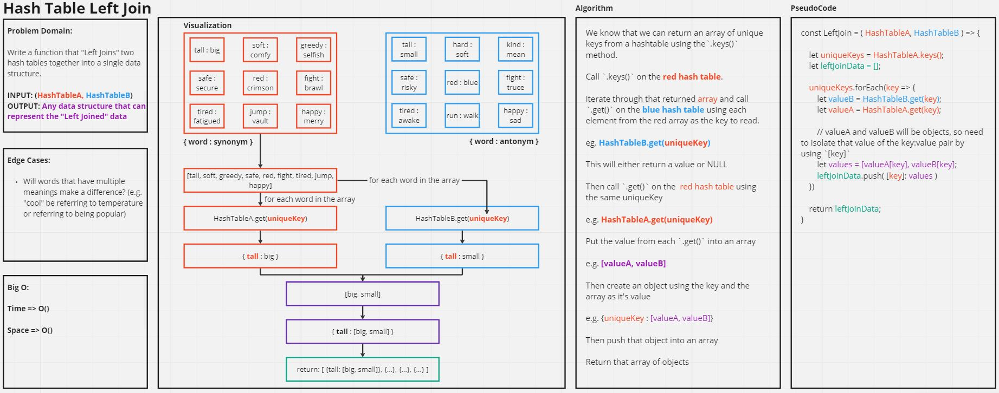

# Code Challenge: Class 27

[leftJoin.js](./leftJoin.js)

Write a function that [LEFT JOINs](https://www.tutorialspoint.com/sql/sql-left-joins.htm) two hashmaps into a single data structure.

- Arguments: two hash maps
  - The first parameter is a hashmap that has word strings as keys, and a synonym of the key as values.
  - The second parameter is a hashmap that has word strings as keys, and antonyms of the key as values.

- Return: The returned data structure that holds the results is up to you. It doesn’t need to exactly match the output below, so long as it achieves the LEFT JOIN logic

Arguments: BinaryTree1, BinaryTree2
Return: Array of duplicate values

- Combine the key and corresponding values (if they exist) into a new data structure according to LEFT JOIN logic.

- LEFT JOIN means all the values in the first hashmap are returned, and if values exist in the “right” hashmap, they are appended to the result row.

- If no values exist in the right hashmap, then some flavor of `null` should be appended to the result row.

## Whiteboard Process

**Tree Intersection Whiteboard**


## Approach and Efficiency

- **Approach:**
  - I knew that I since we want to "join" all values from our "left" table with the "right" table, I could call `.keys()` on the left table to get an array of all the unique keys contained within the left hash table.
  - From there, I knew that I needed to call `.get()` on the right table for every value within the array of unique keys to check if there was a value for each corresponding key.
  - I knew I also needed to get the value for the left table so I would have to call `.get()` on the left table as well
  - Then I decided to combine both of those values into an array and set that array as the value of a new object using the unique key as its key
    - (e.g. `{uniqueKey: [leftValue, rightValue]}`)
  - Then I would take that object from the previous step and push it into an array, and ultimately return that array when I finished iterating through the array of unique keys returned from step 1.

- **Efficiency:** 

  - Time: O(n) where `n` represents the length of `leftTable.buckets` because we need to iterate through all the buckets to get the unique keys.

  - Space: O(n * 2) where `n` represents the amount of truthy `key:value` pairs within the left table, and multiplied by 2 because we're multiplying the amount of values each key has by two (i.e. instead of `key:value` we have `key:[value1, value2]`)
    - *I understand the array is technically still the `value` in the context of a `key:value` pair but we essentially go from having a single string as the value to having two strings as the value in the `key:value` pair.*

## Solution

```
const leftJoin = (leftTable, rightTable) => {

  if (leftTable instanceof HashTable && rightTable instanceof HashTable){
    let uniqueKeys = leftTable.keys();
    let leftJoinData = [];

    uniqueKeys.forEach(key => {
      let valueB = rightTable.get(key);
      let valueA = leftTable.get(key)
      let values;

      if (valueB) {
        values = [valueA[key], valueB[key]];
      } else {
        values = [valueA[key], null]
      }

      leftJoinData.push( {[key]: values} );
    })

    return leftJoinData;
  } else {
    console.error('Both arguments of .leftJoin() must be a HashTable');
  }
}
```