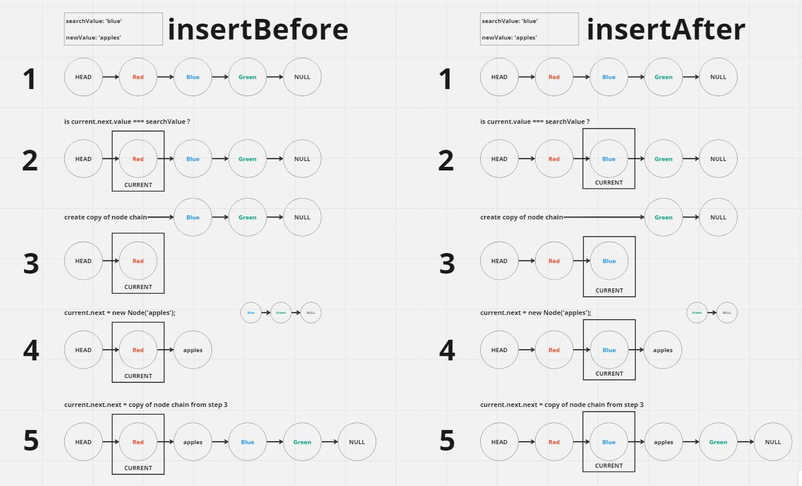
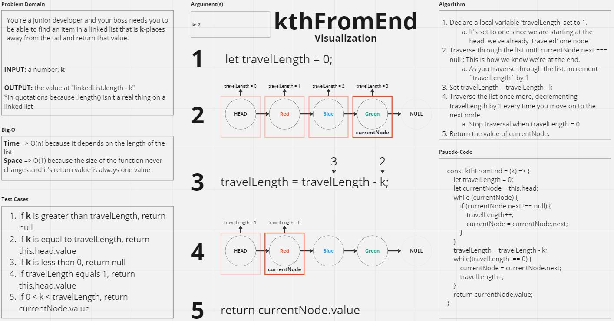
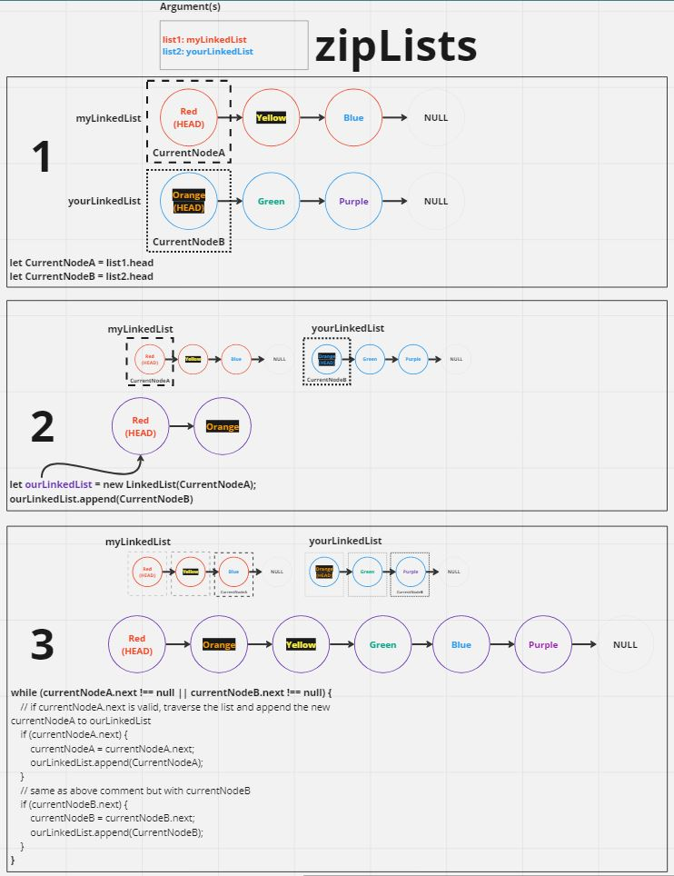

# Code Challenge 05, 06, 07, 08 - Linked List Implementation
Create a Linked List data structure consisting of a Node class and a Linked List class. 

The `Node` class should contain two properties: 
- `value`, which can be a value of any data type
- `next`, which is the next `Node` in the linked list

The `LinkedList` class should have one property:
- `head`, which is a `Node` and is the first item of the linked list.

`LinkedList` should also consist of 0 - n amount of `Node`s and should have various methods that allow a user to modify &/o read the data in the list.

- [LinkedList Module](./index.js)
- [zippedList Module](./zipLists.js)

## Whiteboard Process

### Insert Before / Insert After

### kthFromEnd

* Test Cases #4 in diagram should read 'if travelLength = 0' because travelLength of 0 means that the length of the list is 1

### zipLists

## Approach & Efficiency

### Approach
Since most of the `LinkedList` methods can be successfully accomplished by iterating through the list I stuck with using a `while` loop and applied conditional statments where necessary in order to complete a task.

#### Lab 05
For the `.insert()` method, I knew that since a `LinkedList`'s `head` property is a `Node`, who's `next` property is just a chain of nodes nested within nodes, I could just create a new `LinkedList` and set the `next` property of the `head` Node to be the chain of nodes from the original `LinkedList`, and then use the new chain of nodes as the `head` of the original list.

#### Lab 06

#### Lab 07

#### Lab 08
For the `.zipLists()` method, since the nodes were supposed to be added to the new list alternatively, I knew that I was going to have to traverse each argument list and then add then append those values to the new zipped list before moving the `currentNode` of each argument list to the `next` node. Therefore, I declared two local variables `currentNodeA` and `currentNodeB` to track the `currentNode` of each list. Upon declaration, these local variables are set to their respective `this.head`. Then I declare a new `LinkedList`, called `zippedList`, using `currentNodeA` as it's argument for the constructor. After that, I append `currentNodeB` to the new `LinkedList`. Finally, within a `while` loop, I traverse the each list and, setting `currentNodeA = currentNodeA.next` and `currentNodeB = currentNodeB.next`, and alternatively appending those nodes to `zippedList`.

### Efficiency
- `Node` and `LinkedList` constructor will be always have a Time and Space efficiency of `O(1)` because they both rely on one parameter/argument in order to be created.

- The methods `.includes()`, `.insertBefore()`, `.insertAfter()`, `.append()`, and `.toString()` 
  - Time and Space efficiency of `O(n)` because they all depend on the length of the list.

- The method `.insert()` will have:
  - Time of `O(1)` because it always creates a new list and then sets the value of the new list's `next` as the original linked list.
  - Space of `O(n)` because the space taken will depend on the length of the list

- The method `.kthFromEnd` will have:
  - Time of `O(n)` because it depends on the length of the list
  - Space of `O(1)` because the size of the function and it's return value is always the same size

- The method `.zipLists` will have:
  - Time and Space of `O(n^2)` because it depends on the length of both lists given as arguments

## Solution
- New linked lists can be instantiated with standard javascript class syntax, e.g. `let myLinkedList = new LinkedList(defaultHead)`
  - Passing in a value as the `defaultHead` argument will set that value as the head of the linked list.

- `.append(newValue)` adds a new node to the END / TAIL of the list with a value of `newValue`

- `.insert(newHead)` adds a new node to the BEGINNING / HEAD of the list with a value of `newHead`, and in turn push the pre-existing nodes down the line by one position

- `.insertBefore(searchValue, newValue)` adds a new node with the value of `newValue` before the node who's value is `searchValue`

- `.insertAfter(searchValue, newValue)` adds a new node with the value of `newValue` after the node who's value is `searchValue`

- `.includes(searchValue)` searches the the linked list for a given `searchValue` and returns `true` if the value is found or `false` if no value is found.

- `.kthFromEnd(k)` gets the value of a node that is `k` places from the tail of a linked list or returns null if `k` is an invalid argument

- `.toString()` will return a string of all the values within the linked list in a format of `HEAD -> ...nodes -> TAIL -> NULL`, where `...nodes` represent each node in the linked list. 
  - E.g. a linked list with the values `red, green, blue, apple, orange, banana` will be returned as `red -> green -> blue -> apple -> orange -> banana -> NULL`

- `.zipLists()` will take two lists as arguments and return a new LinkedList which alternatively combines the nodes from both lists given as arguments.