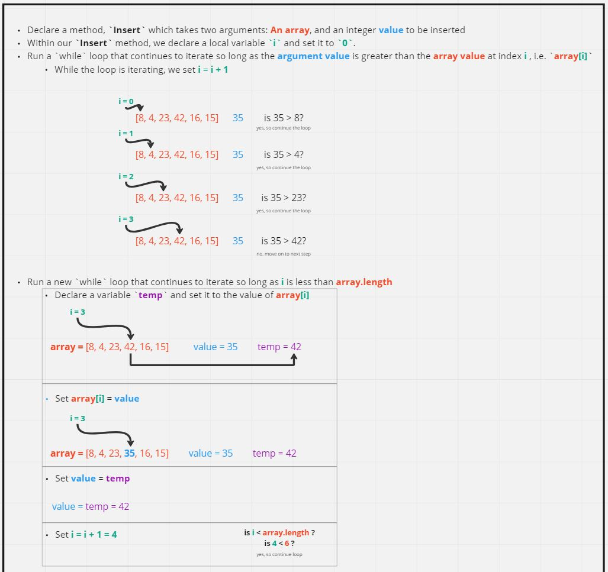
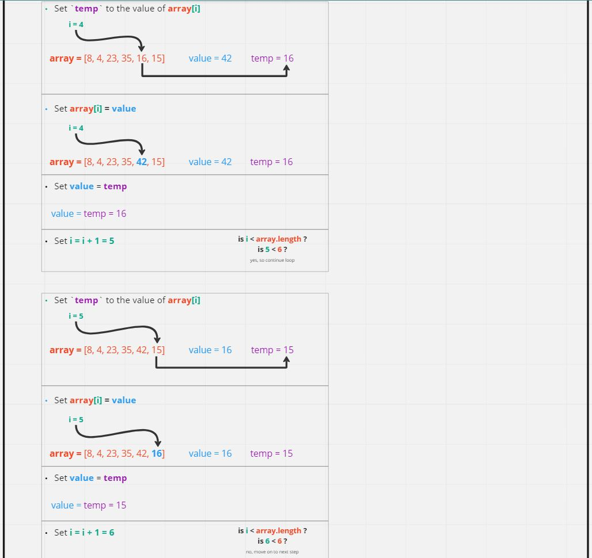
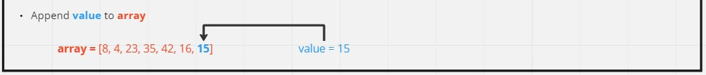
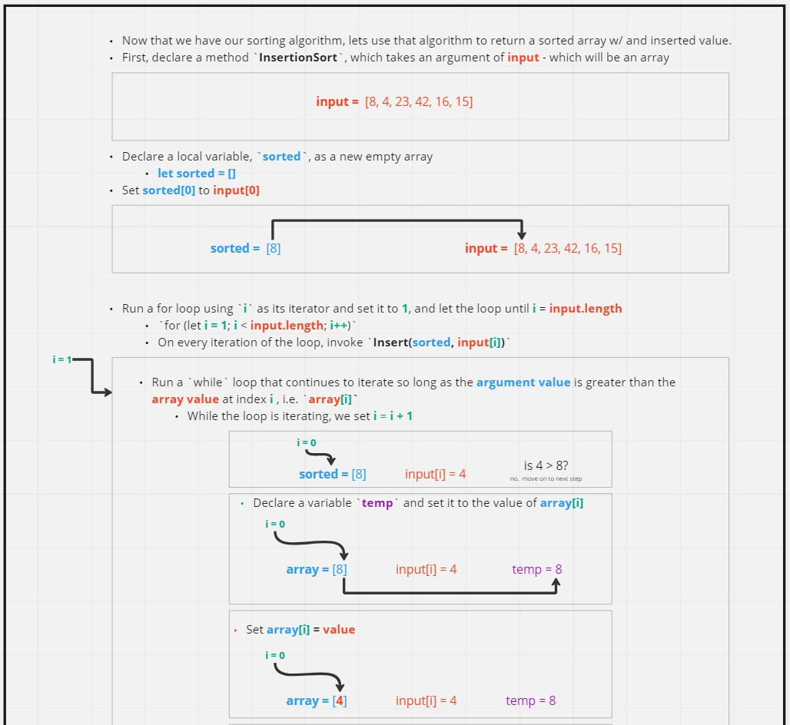
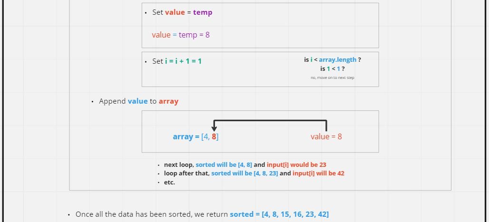

# Code Challenge: Class 26

Review the pseudocode below, then trace the algorithm by stepping through the process with the provided sample array. Document your explanation by creating a blog article that shows the step-by-step output after each iteration through some sort of visual.

```
Insert(int[] sorted, int value)
  initialize i to 0
  WHILE value > sorted[i]
    set i to i + 1
  WHILE i < sorted.length
    set temp to sorted[i]
    set sorted[i] to value
    set value to temp
    set i to i + 1
  append value to sorted

InsertionSort(int[] input)
  LET sorted = New Empty Array
  sorted[0] = input[0]
  FOR i from 1 up to input.length
    Insert(sorted, input[i])
  return sorted
```

## Whiteboard Process

The step by step process can be seen within the UML diagrams

### Insert()





### InsertionSort()




## Approach and Efficiency

Since the pseudocode was already pre-written for us in todays code challenge all I had to focus on was creating a verbose UML.

The efficiency would be `O(n*n)` because the `Insert` method is being called for every element within the array (minus the very first element of the array - would that be `O(n*n - 1)`?)

## Solution

```
const Insert = (array, value) => {
  let i = 0;
  let temp = 0;
  while (value > array[i]) {
    i++;
  }
  while (i < array.length) {
    temp = array[i];
    array[i] = value;
    value = temp;
    i++;
  }
  array[i] = value;
}

const InsertionSort = (array) => {
  let sorted = [];
  sorted[0] = array[0];
  for(let i = 1; i < array.length; i++) {
    Insert(sorted, array[i]);
  }
  return sorted;
}
```