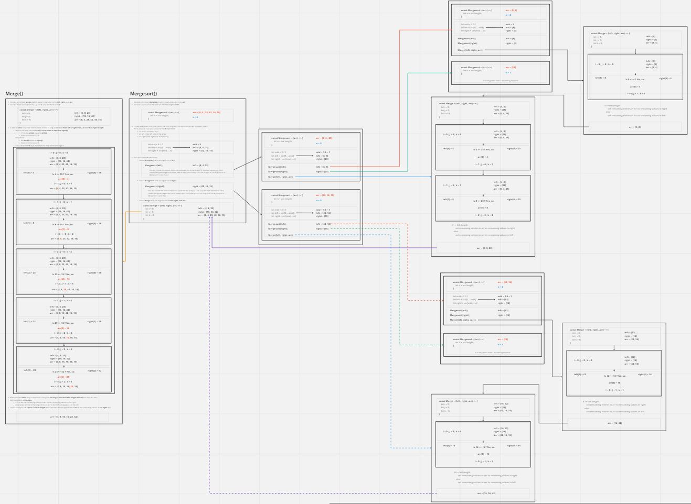

# Code Challenge: Class 27

Review the pseudocode below, then trace the algorithm by stepping through the process with the provided sample array. Document your explanation by creating a blog article that shows the step-by-step output after each iteration through some sort of visual.

```
ALGORITHM Mergesort(arr)
    DECLARE n <-- arr.length

    if n > 1
      DECLARE mid <-- n/2
      DECLARE left <-- arr[0...mid]
      DECLARE right <-- arr[mid...n]
      // sort the left side
      Mergesort(left)
      // sort the right side
      Mergesort(right)
      // merge the sorted left and right sides together
      Merge(left, right, arr)

ALGORITHM Merge(left, right, arr)
    DECLARE i <-- 0
    DECLARE j <-- 0
    DECLARE k <-- 0

    while i < left.length && j < right.length
        if left[i] <= right[j]
            arr[k] <-- left[i]
            i <-- i + 1
        else
            arr[k] <-- right[j]
            j <-- j + 1

        k <-- k + 1

    if i = left.length
       set remaining entries in arr to remaining values in right
    else
       set remaining entries in arr to remaining values in left
```

## Whiteboard Process

The step by step process can be seen within the UML diagrams. Since this method requires recursion, the visualization is a lot bigger than normal. Pay attention to the line color (red, green, blue) and the line type (solid vs. dashed) to see how things connect.

### Overview



### Merge()


### MergeSort()


## Approach and Efficiency

Since the pseudocode was already pre-written for us in todays code challenge all I had to focus on was creating a verbose UML.

Efficiency is `O(n log(n))`
*Honestly, I'm not exactly sure how to explain this one and I only know this because of a google search. I plan on asking for clarification tomorrow in class (class 28)*

## Solution

```
const Merge = (left, right, arr) => {
  let i = 0;
  let j = 0;
  let k = 0;

  while (i < left.length && j < right.length) {
    if(left[i] <= right[j]){
      arr[k] = left[i];
      i++;
    }
    else {
      arr[k] = right[j];
      j++;
    }
    k++;
  }

  if(i === left.length) {
    for(; j < right.length; j++){
      arr[k] = right[j];
      k++;
    }
  }
  else {
    for(; i < left.length; i++){
      arr[k] = left[i];
      k++;
    }
  }

}

const MergeSort = (arr) => {
  let n = arr.length;

  if (n > 1) {
    let mid = Math.floor(n/2);
    let left = [];
    let right = [];
    for(let i = 0; i < mid; i++){
      left.push(arr[i]);
    }
    for(let i = mid; i < arr.length; i++){
      right.push(arr[i]);
    }
    MergeSort(left);
    MergeSort(right);
    Merge(left, right, arr);
  }
}
```