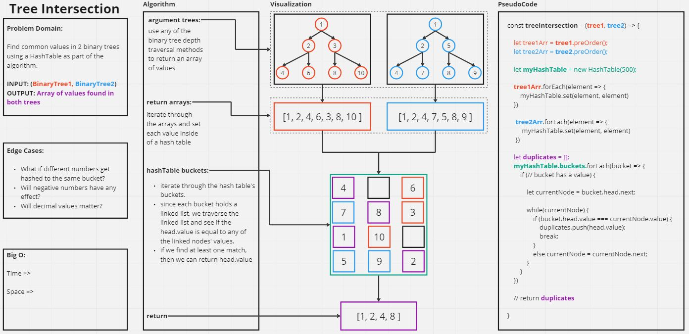
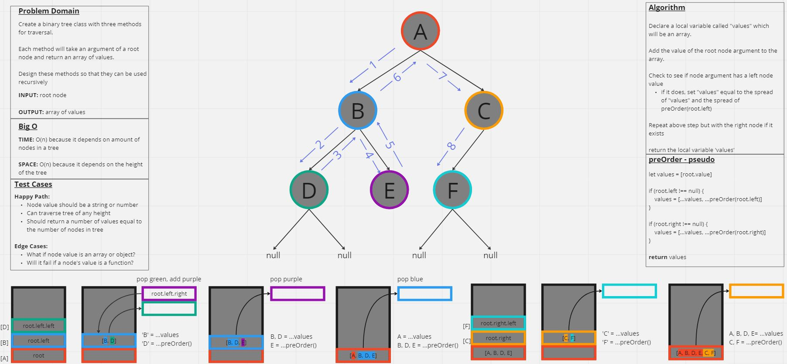

# Code Challenge: Class 27

[treeIntersection.js](./tree-intersection.js)

Write a function called `treeIntersection` that takes two binary trees as parameters. Find common values in 2 binary trees using a HashTable as part of the algorithm.

Arguments: BinaryTree1, BinaryTree2
Return: Array of duplicate values

## Whiteboard Process

**Tree Intersection Whiteboard**


**Refersher on How Binary Tree Depth Traversal Works**


## Approach and Efficiency

- **Approach:**


- **Efficiency:** 

  - Time 

  - Space 

## Solution

```

```