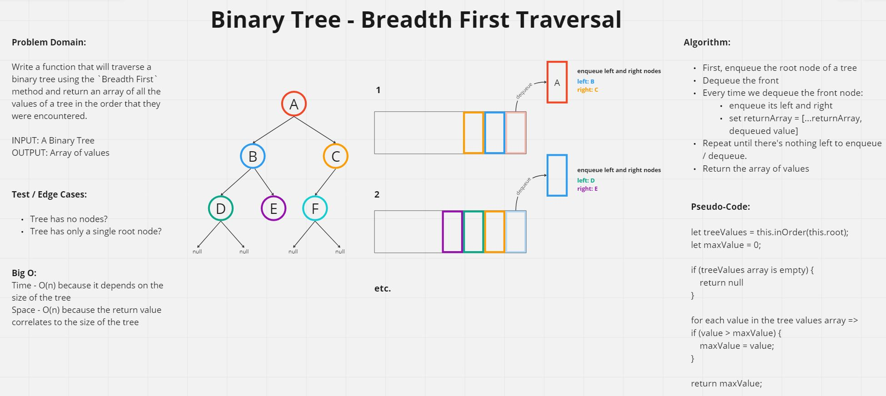
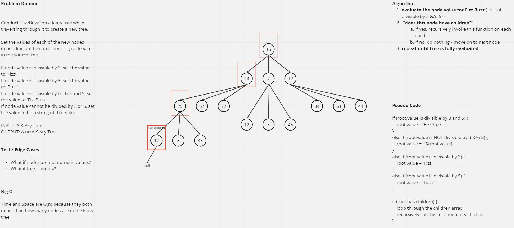

# Code Challenge 15 - Binary Trees & Binary Search Trees
Create a `Node` class that has a `value`, `left`, and `right` property.

Create a `Binary Tree` class that has three different methods for depth traversal, `preOrder`, `inOrder`, and `postOrder`. Each method should return an array of values.

Create a `Binary Search Tree` that extends the `Binary Tree` class with the methods `add` and `contains`.
  - `add` will take one argument, a value, and should add a new `Node` in the correct location in the binary search tree
  - `contains` will take one argument, a value, and return `true` or `false` if the tree contains the value at least once.

-[Binary Tree](./binaryTree.js)

## Whiteboard Process


## Approach & Efficiency

I followed the template for tree traversal as outlined in the Code Fellows [reading material](https://codefellows.github.io/common_curriculum/data_structures_and_algorithms/Code_401/class-15/resources/Trees.html). The only thing I had to do was figure out how to return an array of results which I accomplished by using a local variable and the spread operator.

Time: O(n) because it depends on how many nodes are in the tree

Space: O(h) because it depends on the height of the tree

## Solution
```
  preOrder = (root) => {

    let valueArray = [root.value]
    
    if (root.left !== null) {
      valueArray = [...valueArray, ...this.preOrder(root.left)]
    };

    if (root.right !== null){
      valueArray = [...valueArray, ...this.preOrder(root.right)]
    };

    return valueArray

  }
```
---

# Code Challenge 16 - Find The Maximum Value of a Binary Tree
Assuming that all the values stored in a Binary Tree are numeric, create a method that finds the maximum value within the tree.

-[binaryTree.js](./binaryTree.js)

## Whiteboard Process
No whiteboard process because we will just be using the array of values returned from any of the depth traversal methods and then iterating through that returned array to find the highest value.

## Approach and Efficiency
Since we need to traverse through the entire tree to know the maximum value we can use any of the previously created depth traversal methods which return an array of all the values within the tree. After we have those values, we can iterate through them all and determine which one is the highest and ultimately return that value.

Time: O(2n) because we are iterating through the tree once to get all of the values and then iterating through all of the values to get the maximum value

Space: O(1) because it will always return a single value

## Solution
```
  maxValue = () => {
    let values = this.inOrder(this.root);
    let maxValue = 0;
    if (!values.length) {
      return null
    }
    values.forEach(value => {
      if (value > maxValue) {
        maxValue = value;
      }
    })
    return maxValue;
  }
```

---

# Code Challenge 17 - Breadth First Traversal on Binary Tree
Write a function that will traverse a binary tree using the `Breadth First` method and return an array of all the values of a tree in the order that they were encountered.

## Whiteboard Process


## Approach and Efficiency
I followed the approach that was outlined in the [Code Fellows Trees Reading Material](https://codefellows.github.io/common_curriculum/data_structures_and_algorithms/Code_401/class-15/resources/Trees.html) for Breadth First traversal. Essentially, we begin by enqueing the tree's root node to a queue. Then we dequeue the front of the queue - and when we dequeue that node we will then enqueue it's left and right nodes, repeating that process until there is nothing left to enqueue/dequeue. Every time something is dequeued, the value of that node will be added to an array and the array will be ultimately returned when there is nothing in the queue. 

## Solution

```
const breadthFirst = (tree) => {
  const nodeQueue = new Queue();
  nodeQueue.front = tree.root
  let breadthArray = [];

  while (!nodeQueue.isEmpty()) {
    let oldFront = nodeQueue.dequeue()
    breadthArray = [...breadthArray, oldFront.value];
    if (oldFront.left) {
      nodeQueue.enqueue(oldFront.left)
    }
    if (oldFront.right) {
      nodeQueue.enqueue(oldFront.right)
    }
  }

  return breadthArray;
}
```

---

# Code Challenge 18 - Conduct FizzBuzz on a K-Ary Tree
Conduct “FizzBuzz” on a k-ary tree while traversing through it to create a new tree.

Set the values of each of the new nodes depending on the corresponding node value in the source tree.

If node value is divisible by 3, set the value to 'Fizz'
If node value is divisible by 5, set the value to 'Buzz'
If node value is divisible by both 3 and 5, set the value to 'FizzBuzz'
If node value cannot be divided by 3 or 5, set the value to be a string of that value.

## Whiteboard Process


## Approach and Efficiency
I knew that I could accomplish this goal by using the recursive nature of depth first traversal and altering the node's values as I traversed the tree.

As the tree is being traversed, we check if the value can be divided by 3 &/o 5 and set the new value of the node accordingly until there are no more nodes left to evaluate.

I tried a few different strategies but I could not figure out how to return a new tree so right now this method modifies the tree in place. I tried to create a deep copy of the tree, modify those values and then return that tree but it was not working the way I intended so this is as far as I could successfully get.

Time and Space are O(n) because they both depend on how many nodes there are in the tree.

## Solution

```
  depthTraversal = (root) => {

    if (root.value % 3 === 0 && root.value % 5 === 0) {
      root.value = 'FizzBuzz';
    }
    else if (root.value % 3 !== 0 && root.value % 5 !== 0) {
      root.value = `${root.value}`;
    }
    else if (root.value % 3 === 0 && root.value % 5 !== 0){
      root.value = 'Fizz'
    }
    else if (root.value % 5 === 0 && root.value % 3 !== 0){
      root.value = 'Buzz'
    }

    if(root.children) {
      root.children.forEach(child => {
        this.depthTraversal(child);
      })
    }

  }

  fizzBuzzTree = () => {
    return this.depthTraversal(this.root)
  }
```