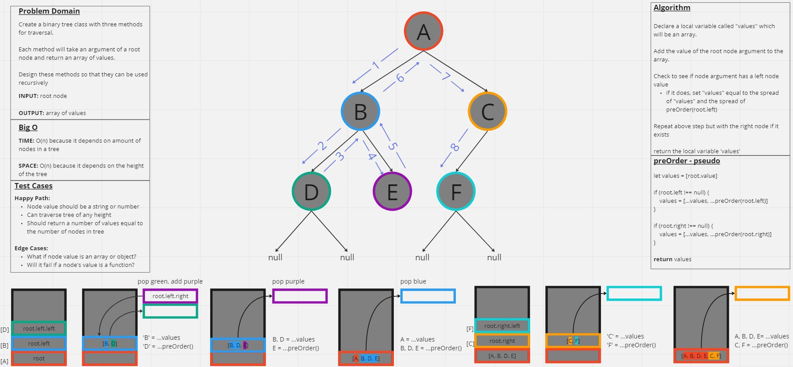

# Code Challenge 15 - Binary Trees & Binary Search Trees
Create a `Node` class that has a `value`, `left`, and `right` property.

Create a `Binary Tree` class that has three different methods for depth traversal, `preOrder`, `inOrder`, and `postOrder`. Each method should return an array of values.

Create a `Binary Search Tree` that extends the `Binary Tree` class with the methods `add` and `contains`.
  - `add` will take one argument, a value, and should add a new `Node` in the correct location in the binary search tree
  - `contains` will take one argument, a value, and return `true` or `false` if the tree contains the value at least once.

-[Binary Tree](./binaryTree.js)

## Whiteboard Process


## Approach & Efficiency

I followed the template for tree traversal as outlined in the Code Fellows [reading material](https://codefellows.github.io/common_curriculum/data_structures_and_algorithms/Code_401/class-15/resources/Trees.html). The only thing I had to do was figure out how to return an array of results which I accomplished by using a local variable and the spread operator.

Time: O(n) because it depends on how many nodes are in the tree

Space: O(h) because it depends on the height of the tree

## Solution
```
  preOrder = (root) => {

    let valueArray = [root.value]
    
    if (root.left !== null) {
      valueArray = [...valueArray, ...this.preOrder(root.left)]
    };

    if (root.right !== null){
      valueArray = [...valueArray, ...this.preOrder(root.right)]
    };

    return valueArray

  }
```