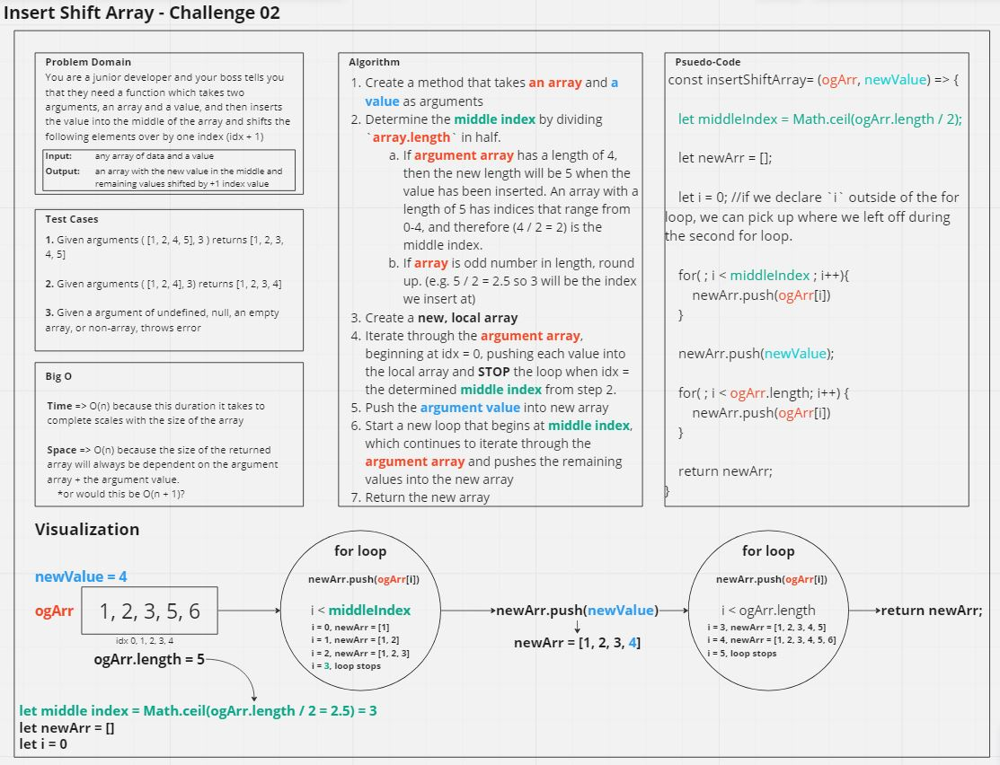

# Code Challenge 02 - Insert Shift Array
Write a function called insertShiftArray which takes in an array and a value to be added. Without utilizing any of the built-in methods available to your language, return an array with the new value added at the middle index.

## Whiteboard Process
Whiteboard: https://miro.com/app/board/uXjVMW88ZwA=/?share_link_id=400719331291

## Approach & Efficiency
I decided to determine the index for insertion by dividing the original array's length by 2 and then rounding that value up. Since arrays start at 0 and the new array's length will be the original array's length + 1, this will always yield the correct index for insertion.

After that, I decided to run two for loops. The first one runs so long as `i` is less than the middle index determined above. Then when that loop is done, we insert the value given as an argument, and then run one last loop so long as `i` is less than the length of the original array.

`i` is scoped locally to the function, not scoped within the for loops, which means the second for loop will pick up right where we left off on the first loop. 

## Solution
<!-- Show how to run your code, and examples of it in action -->