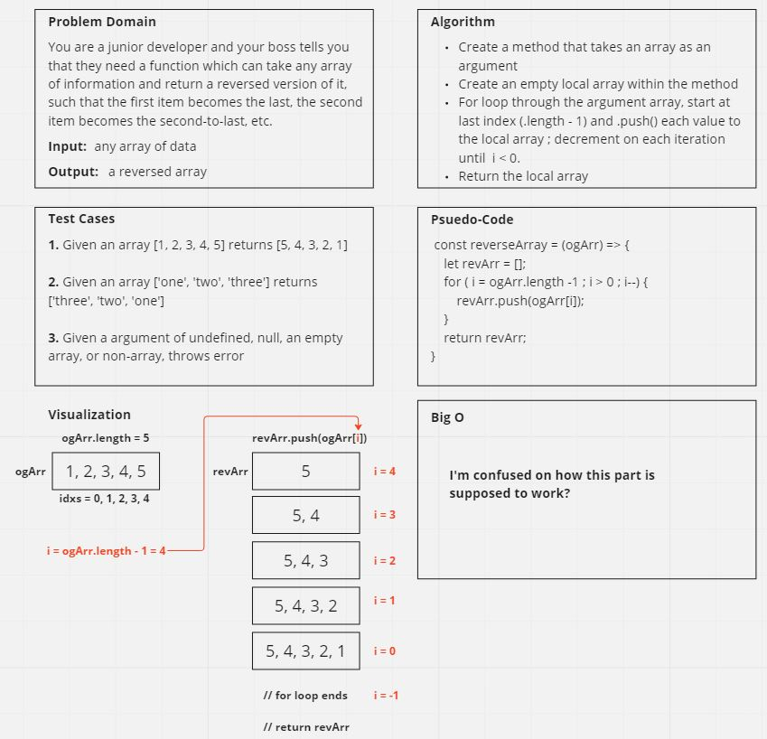

# Code Challenge 01 - Reverse Array
<!-- Description of the challenge -->

## Whiteboard Process
Whiteboard: https://miro.com/app/board/uXjVMW88ZwA=/?share_link_id=400719331291

## Approach & Efficiency
<!-- What approach did you take? Why? What is the Big O space/time for this approach? -->

## Solution
<!-- Show how to run your code, and examples of it in action -->